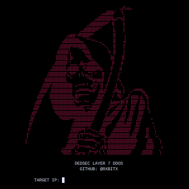

<h1 align="center"> DEDSEC LAYER 7 </h1>
<h4 align="center"> Dedsec-layer7 is Dedsec tool coded by 0xbit, designed to perform Distributed Denial of Service (DDoS) attacks, Focus on Layer 7. </h4>

### INSTALLATION
* git clone https://github.com/0xbitx/Dedsec-layer7.git
* cd Dedsec-layer7
* chmod +x dedsec-layer7.py
* python3 dedsec-layer7.py

### TESTED ON FOLLOWING:
* Kali Linux
* Parrot OS
* Ubuntu

### PREREQUISITES
* high bandwidth

### LANGUAGE 
* Python

<h1 align="center"> DISCLAIMER </h1>

<h4 align="center">I'm not responsible for anything you do with this program, so please only use it for good and educational purposes. </h4>
